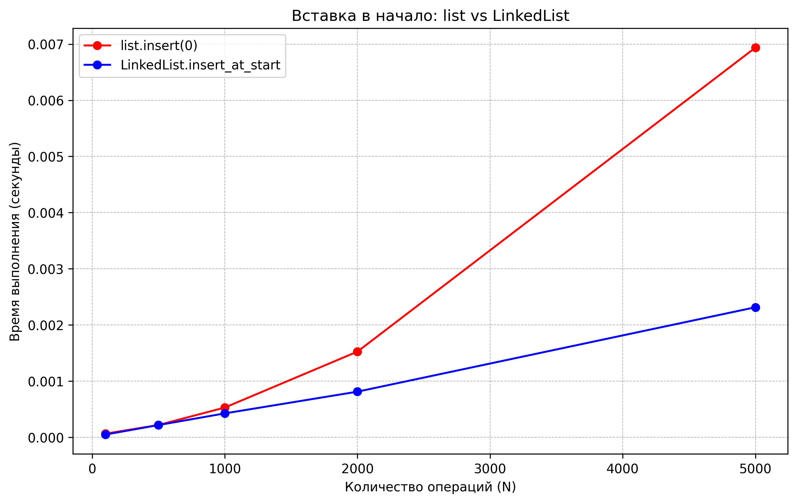
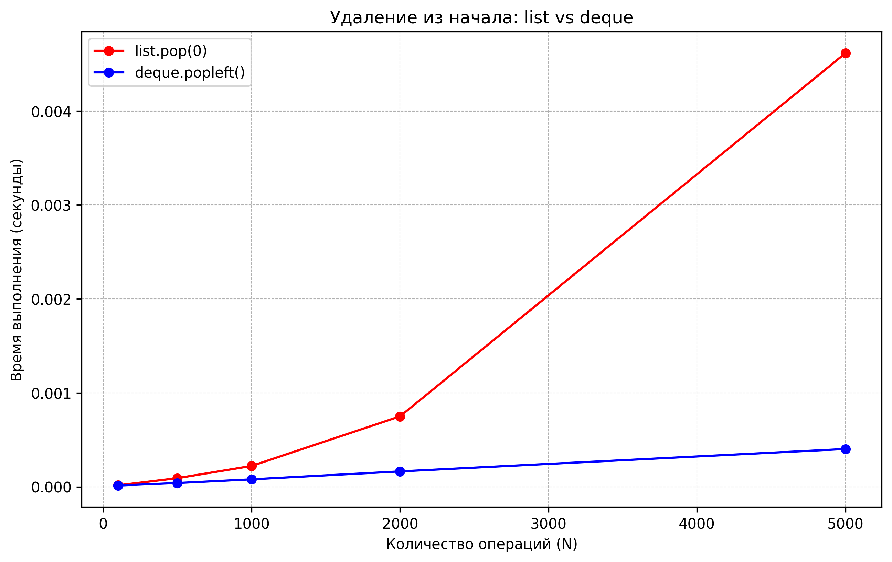

# Отчет по лабораторной работе 02
## Основные структуры данных. Анализ и применение

**Дата:** 2025-11-30  
**Семестр:** 3 курс 5 семестр 
**Группа:** ПИЖ-б-о-23-1  
**Дисциплина:** Анализ сложности алгоритмов  
**Студент:** Плескачёв Александр Михайлович 

### Цель работы
Изучить понятие и особенности базовых абстрактных типов данных (стек, очередь, дек, связный список) и их реализаций в Python. Научиться выбирать оптимальную структуру данных для решения конкретной задачи, основываясь на анализе теоретической и практической сложности операций. Получить навыки измерения производительности и применения структур данных для решения практических задач.

### Теоретическая часть

**Список (list)** — реализация динамического массива в Python.
- Добавление в конец (append) выполняется в среднем за O(1)
- Вставка и удаление в середине требуют O(n) из-за необходимости сдвига элементов
- Доступ по индексу — O(1)

**Связный список (Linked List)** — структура данных, состоящая из узлов
- Вставка и удаление в начало списка выполняются за O(1)
- Доступ по индексу и поиск элемента — O(n)

**Стек (Stack)** — структура данных по принципу LIFO (последним пришел — первым ушел)
- Основные операции: push (добавление, O(1)), pop (удаление с вершины, O(1)), peek (просмотр вершины, O(1))
- В Python может быть реализован на основе списка

**Очередь (Queue)** — структура данных по принципу FIFO (первым пришел — первым ушел)
- Основные операции: enqueue (добавление в конец, O(1)), dequeue (удаление из начала, O(1))
- Для эффективной реализации в Python используется collections.deque

**Дек (Deque)** — двусторонняя очередь с возможностью добавления/удаления с обоих концов
- Все основные операции — O(1)
- Реализован в классе collections.deque

### Практическая часть

#### Реализованные методы

**linked_list.py**
- `insert_at_start(data)` — O(1)
- `insert_at_end(data)` — O(1) с использованием tail-указателя
- `delete_from_start()` — O(1)
- `traversal()` — O(n)
- `size()` — O(n)

**task_solutions.py**
- `is_balanced_brackets()` — O(n) - проверка корректности расстановки скобок с применением стека
- `is_palindrome_deque()` — O(n) - проверка строки на палиндром с использованием дека
- `print_queue_simulation()` — O(n) - имитация обработки заданий в очереди печати

#### Характеристики тестового оборудования
- **Процессор:** AMD Ryzen 3 5300U
- **Оперативная память:** 8 GB DDR4
- **Операционная система:** Windows 11
- **Версия Python:** 3.13.2

## Графики производительности

### 1. Сравнение операций вставки в начало

**Анализ результатов:**
- `LinkedList.insert_at_start` — O(1) (время выполнения постоянно)
- `list.insert(0)` — O(n) (время растет линейно с увеличением количества элементов)

### 2. Сравнение операций удаления из начала

**Анализ результатов:**
- `deque.popleft()` — O(1) (эффективная реализация)
- `list.pop(0)` — O(n) (требует перемещения оставшихся элементов)

#### Результаты решения практических задач

**1. Проверка корректности скобочных последовательностей**
- Применен стек на основе list
- Протестированы разнообразные комбинации скобок
- Все тестовые примеры обработаны верно

**2. Проверка строк на палиндром**
- Использован deque для эффективной проверки с обоих концов
- Протестированы строки на разных языках
- Числовые последовательности также корректно обработаны

**3. Имитация очереди печати**
- Реализована с использованием deque
- Наглядно продемонстрирован принцип FIFO
- Все задания обработаны в порядке поступления

### Основные выводы

1. **Экспериментальное подтверждение теоретической сложности:**
   - Операции `LinkedList.insert_at_start` и `deque.popleft()` демонстрируют сложность O(1)
   - Операции `list.insert(0)` и `list.pop(0)` показывают сложность O(n)

2. **Рекомендации по использованию структур данных:**
   - Для операций в начале структуры данных целесообразно использовать LinkedList или deque
   - Стандартный список Python эффективен как динамический массив для доступа по индексу и добавления в конец
   - При частых операциях с обоих концов структуры данных следует применять deque

3. **Практическая ценность:**
   - Реализованные алгоритмы демонстрируют эффективное применение структур данных
   - Правильный выбор структуры данных существенно влияет на производительность приложений

### Контрольные вопросы

**1. В чем основное различие между динамическим массивом (list в Python) и связным списком с точки зрения сложности операций вставки в начало и доступа по индексу?**

- **Доступ по индексу:**
  - Динамический массив (list): O(1) — прямой доступ к элементу по его позиции
  - Связный список: O(n) — требуется последовательный проход от начала списка

- **Вставка в начало:**
  - Динамический массив: O(n) — требует перемещения всех существующих элементов
  - Связный список: O(1) — достаточно изменить ссылки в узлах

**2. Объясните принципы работы стека (LIFO) и очереди (FIFO). Приведите по два примера их практического применения.**

**Стек (LIFO — Last In, First Out):**
- Элемент, добавленный последним, извлекается первым
- Примеры использования:
  - Система отмены действий в программах
  - Анализ корректности скобочных последовательностей (как в выполненной работе)

**Очередь (FIFO — First In, First Out):**
- Элемент, добавленный первым, извлекается первым
- Примеры использования:
  - Очередь заданий на печать (как в реализованной симуляции)
  - Обработка запросов пользователей в веб-приложениях

**3. Почему операция удаления первого элемента из списка (list) в Python имеет сложность O(n), а из дека (deque) — O(1)?**

- **list:** Удаление первого элемента требует перемещения всех оставшихся элементов на одну позицию вперед — O(n)
- **deque:** Реализован как двусвязный список или кольцевой буфер, что позволяет удалять первый элемент за O(1) без перемещения других элементов

**4. Какую структуру данных вы бы выбрали для реализации механизма отмены действий в текстовом редакторе? Обоснуйте выбор.**

**Рекомендуемая структура:** стек (LIFO)  
**Обоснование:** Последнее выполненное действие должно быть первым доступным для отмены. Стек идеально соответствует этому требованию благодаря принципу LIFO — последнее добавленное действие извлекается первым. Этот подход аналогичен использованию стека для проверки скобок в выполненной работе, где стек применялся для отслеживания последних открытых скобок.

**5. Измерения показали, что вставка 1000 элементов в начало списка заняла значительно больше времени, чем вставка в начало реализованного связного списка. Объясните эти результаты с позиции асимптотической сложности.**

- **list:** Каждая вставка в начало требует сдвига всех элементов — O(n) на операцию, 1000 операций ≈ O(n·1000)
- **Связный список:** Каждая вставка в начало выполняется через изменение указателей — O(1) на операцию, 1000 операций ≈ O(1000)

**Заключение:** Динамический массив демонстрирует более низкую производительность при вставке в начало из-за необходимости перемещения элементов, что подтверждается графиками производительности. Связный список выполняет эту операцию значительно быстрее благодаря работе с указателями, что делает его предпочтительным выбором для сценариев с частыми операциями вставки/удаления в начале структуры данных.