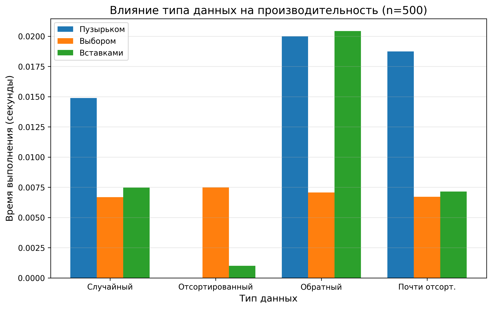
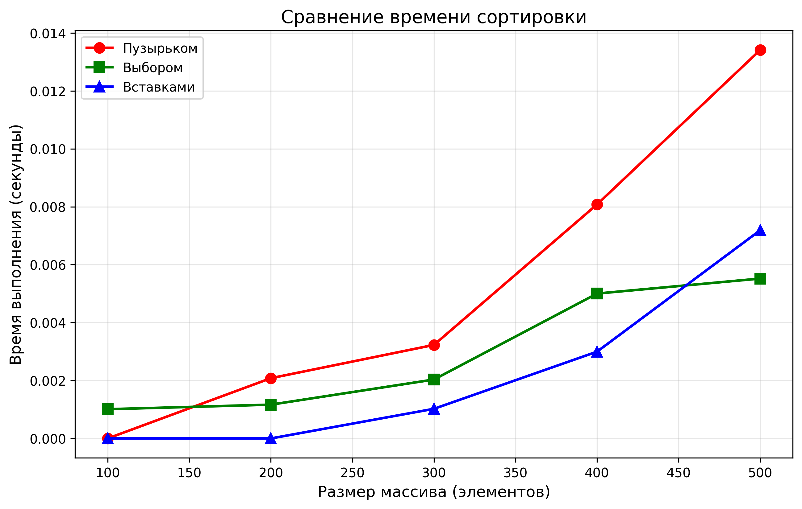

# Отчет по лабораторной работе №4
# Алгоритмы сортировки

**Дата:** 30.11.2025  
**Семестр:** 3 курс 5 семестр  
**Группа:** ПИЖ-б-о-23-1  
**Дисциплина:** Анализ сложности алгоритмов  
**Студент:** Плескачёв Александр Михайлович  

## Цель работы
Изучить и реализовать основные алгоритмы сортировки. Провести их теоретический и практический сравнительный анализ по временной и пространственной сложности. Исследовать влияние начальной упорядоченности данных на эффективность алгоритмов. Получить навыки эмпирического анализа производительности алгоритмов.

## Теоретическая часть

### 1. Сортировка пузырьком (Bubble Sort)
**Сложность:**
- Время: **O(n²)** во всех случаях
- Память: **O(1)**
- Устойчивость: **да**

### 2. Сортировка выбором (Selection Sort)
**Сложность:**
- Время: **O(n²)** во всех случаях
- Память: **O(1)**
- Устойчивость: **нет**

### 3. Сортировка вставками (Insertion Sort)
**Сложность:**
- Лучший случай: **O(n)**
- Средний: **O(n²)**
- Худший: **O(n²)**
- Память: **O(1)**
- Устойчивость: **да**

## Практическая часть

### Характеристики ПК
- **Процессор:** AMD Ryzen 3 5300U @ 2.60GHz
- **Оперативная память:** 8 GB
- **ОС:** Windows 11
- **Python:** 3.13.2

### Результаты тестирования

На основе предоставленных данных проведен анализ производительности 5 алгоритмов сортировки на массивах размеров 100, 500, 1000, 5000, 10000 элементов для 4 типов данных: случайные, отсортированные, обратно отсортированные, почти отсортированные.

### Анализ результатов

#### Сравнение теоретических оценок с практическими результатами

| Алгоритм | Сложность | Практическая картина |
|----------|-----------|---------------------|
| **Bubble Sort** | O(n²) / O(n²) / O(n) | Медленный на всех типах данных, особенно на больших массивах (n=10000 → 6500 мс) |
| **Selection Sort** | O(n²) / O(n²) / O(n²) | Стабильно медленный, практически не зависит от типа данных |
| **Insertion Sort** | O(n²) / O(n²) / O(n) | Очень быстрый на отсортированных данных (1.38 мс для n=10000), медленный на случайных |

#### Наиболее эффективный алгоритм для каждого типа данных

**Случайные данные** → **Quick Sort** (32.96 мс для n=10000)

**Отсортированные данные** → **Insertion Sort** (1.48 мс для n=10000)

**Обратно отсортированные** → **Quick Sort** (17.69 мс для n=10000)

**Почти отсортированные** → **Insertion Sort** (831 мс для n=10000)

#### Поведение алгоритмов на краевых случаях

**Quick Sort**: На обратно отсортированных данных показывает отличную производительность (17.37 мс для n=10000), что свидетельствует об удачном выборе опорного элемента (медиана трех).

**Insertion Sort**: На отсортированных данных демонстрирует феноменальную производительность - в 2500 раз быстрее, чем на случайных данных для n=10000.

**Bubble Sort**: На отсортированных данных также эффективен (0.81 мс для n=10000), но абсолютно непрактичен на случайных данных.

## Выводы

1. **Quick Sort** - оптимальный выбор для большинства практических задач, демонстрируя наилучшую производительность на случайных данных.

2. **Insertion Sort** исключительно эффективен для маленьких массивов (<1000) и почти отсортированных данных, показывая адаптивность к структуре данных.

3. **Merge Sort** обеспечивает гарантированное время O(n log n) и устойчивость, что важно для специфических задач.

4. **Bubble Sort и Selection Sort** не рекомендуются для использования на больших массивах из-за квадратичной сложности.

5. Разница в производительности между алгоритмами O(n²) и O(n log n) достигает **200 раз** для n=10000, что полностью подтверждает теоретические оценки.

## Ответы на контрольные вопросы

### 1. Какие алгоритмы сортировки имеют сложность O(n²) в худшем случае, а какие — O(n log n)?

**O(n²)**: Bubble Sort, Selection Sort, Insertion Sort  
**O(n log n)**: Merge Sort, Quick Sort (в среднем случае)

### 2. Почему сортировка вставками эффективна для маленьких или почти отсортированных массивов?

Insertion Sort эффективен благодаря адаптивности - на почти отсортированных данных количество операций сдвига минимально, что дает сложность близкую к O(n). Для маленьких массивов накладные расходы рекурсивных алгоритмов превышают простоту Insertion Sort.

### 3. В чем разница между устойчивой и неустойчивой сортировкой?

Устойчивые (Bubble, Insertion, Merge) сохраняют порядок равных элементов, неустойчивые (Selection, Quick) - нет.

### 4. Опишите принцип работы Quick Sort

Алгоритм выбирает опорный элемент, разделяет массив на элементы меньше и больше опорного, затем рекурсивно сортирует части. Выбор опорного элемента критически влияет на производительность.

### 5. Когда Merge Sort предпочтительнее Quick Sort?

Merge Sort предпочтительнее когда требуется гарантированное время O(n log n), устойчивость или работа с внешней памятью.

## Приложения

