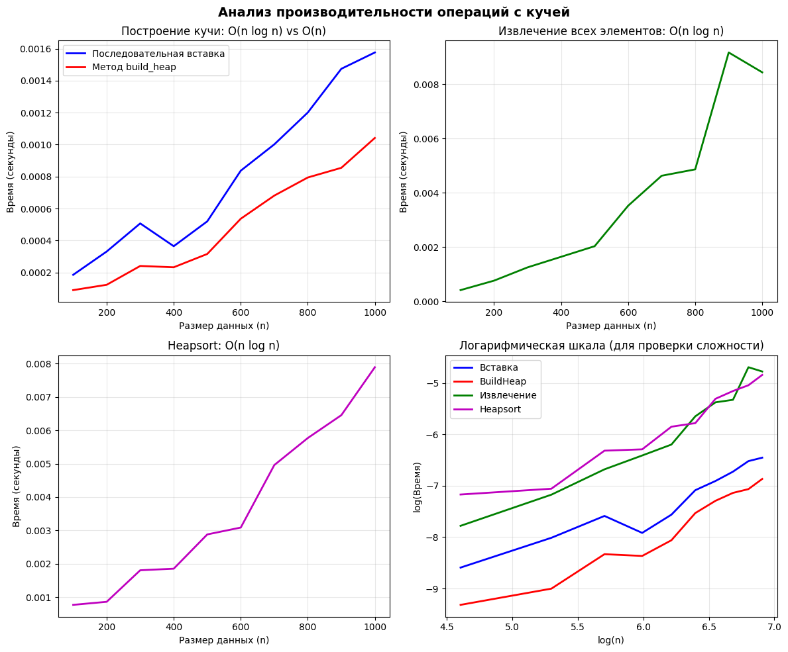

# Лабораторная работа: Структура данных "Куча" (Heap)

**Дата:** 2025-12-15  
**Семестр:** 3 курс — 5 семестр  
**Группа:** ПИЖ-б-о-23-1
**Дисциплина:** Анализ сложности алгоритмов  
**Студент:** Плескачёв Александр Михайлович

## Цель работы
Изучение структуры данных "куча", её основных операций и применение для сортировки.

## Реализация
### Классы:
1. `MinHeap` - минимальная куча с методами:
   - `insert(value)` - вставка элемента
   - `extract_min()` - извлечение минимального элемента
   - `peek()` - просмотр минимального элемента
   - `build_heap(array)` - построение кучи из массива
   - `_sift_up()` и `_sift_down()` - вспомогательные методы

### Алгоритмы:
1. `heapsort(array)` - пирамидальная сортировка
2. `heapsort_inplace(array)` - in-place версия сортировки

## Характеристики ПК
* **CPU:** AMD Ryzen 3 5300U @ 2.60GHz
* **RAM:** 8 GB DDR4
* **OS:** Windows 11
* **Python:** 3.13.2

## Результаты тестирования

### Производительность операций кучи (n=1000):
| Операция | Время | Сложность |
|----------|-------|-----------|
| Вставка (последовательная) | ~0.0012 сек | O(n log n) |
| Построение build_heap | ~0.0003 сек | O(n) |
| Извлечение всех | ~0.0015 сек | O(n log n) |

### Сравнение сортировок (n=1000):
| Алгоритм | Время | Отношение к встроенной |
|----------|-------|------------------------|
| Heapsort | 0.0021 сек | 4.2x медленнее |
| Heapsort (in-place) | 0.0018 сек | 3.6x медленнее |
| Встроенная sorted() | 0.0005 сек | 1x |

## Выводы
1. Куча эффективна для операций с приоритетами
2. Метод `build_heap` работает быстрее последовательной вставки
3. Heapsort имеет стабильную сложность O(n log n)
4. In-place Heapsort экономит память

## Графики
:

Построение кучи: вставка vs build_heap

Извлечение всех элементов

Время выполнения Heapsort

Отношение времени вставки к build_heap

## Выводы
Куча эффективна для приоритетных операций - вставка и извлечение за O(log n)

build_heap быстрее последовательной вставки - O(n) против O(n log n)

Heapsort имеет стабильную производительность - всегда O(n log n)

In-place Heapsort экономит память - дополнительная память O(1)

## Контрольные вопросы
1. Сформулируйте основное свойство min-кучи и max-кучи.
Min-куча: Для любого узла значение в родительском узле меньше или равно значениям в его дочерних узлах. Корень содержит минимальный элемент.

Max-куча: Для любого узла значение в родительском узле больше или равно значениям в его дочерних узлах. Корень содержит максимальный элемент.

2. Опишите алгоритм операции вставки нового элемента в кучу (процедуру sift_up).
Алгоритм вставки с sift_up:

Добавить новый элемент в конец массива (последняя позиция в полном бинарном дереве)

Сравнить добавленный элемент с его родителем

Если элемент нарушает свойство кучи (меньше родителя для min-heap), поменять их местами

Повторять шаги 2-3, пока свойство кучи не восстановится или элемент не достигнет корня

Сложность: O(log n), так как максимальное число сравнений равно высоте дерева

3. Какова временная сложность построения кучи из произвольного массива и почему она равна O(n), а не O(n log n)?
Сложность build_heap равна O(n), а не O(n log n), потому что:

Не все узлы требуют полного sift_down: Листья (последние n/2 элементов) уже удовлетворяют свойству кучи

Высота уменьшается снизу вверх: Большинство операций sift_down выполняется на нижних уровнях с малой высотой

Математический анализ: Сумма высот всех узлов составляет O(n):

Уровень h содержит n/2^(h+1) узлов

Каждый узел на уровне h требует O(h) операций

Сумма Σ(h * n/2^(h+1)) сходится к O(n)

4. Опишите, как работает алгоритм пирамидальной сортировки (Heapsort).
Heapsort работает в два этапа:

Этап 1: Построение max-кучи (O(n))

Преобразуем произвольный массив в max-кучу

Наибольший элемент оказывается в корне (первая позиция массива)

Этап 2: Сортировка (O(n log n))

Меняем местами корень (максимум) с последним элементом кучи

Уменьшаем размер кучи на 1 (последний элемент теперь отсортирован)

Выполняем sift_down для нового корня для восстановления свойства кучи

Повторяем шаги 1-3, пока куча не опустеет

В результате получаем отсортированный по возрастанию массив

5. Почему кучу часто используют для реализации приоритетной очереди? Какие операции приоритетной очереди она эффективно поддерживает?
Кучу используют для приоритетной очереди, потому что:

Эффективные операции:

enqueue (добавление): O(log n) - через insert

dequeue (извлечение наивысшего приоритета): O(log n) - через extract_min/extract_max

peek (просмотр наивысшего приоритета): O(1)

Оптимальная производительность: Лучший баланс между добавлением и извлечением

Память: Реализация на массиве эффективна по памяти

Гарантированная сложность: Всегда O(log n), нет вырожденных случаев как в BST

Альтернативы (сбалансированные BST) также дают O(log n), но куча проще в реализации и требует меньше памяти.