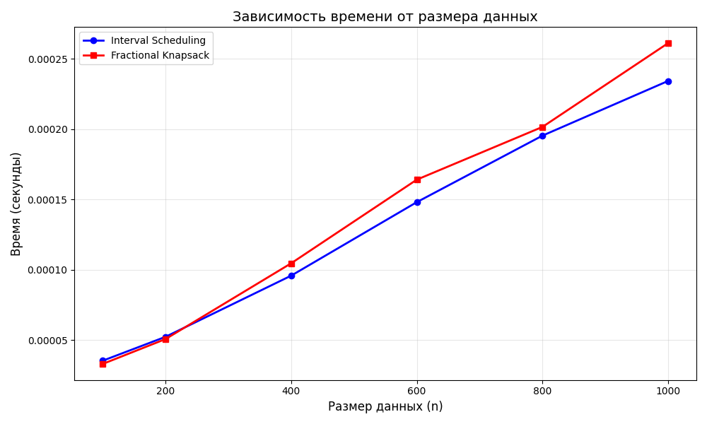

# Отчет по лабораторной работе: Жадные алгоритмы

**Дата:** 2025-12-15 
**Студент:** Плескачёв Александр Михайлович  
**Группа:** ПИЖ-б-о-23-1

## Цель работы
Изучить метод проектирования алгоритмов, известный как "жадный алгоритм". Освоить принцип принятия локально оптимальных решений на каждом шаге и понять условия, при которых этот подход приводит к глобально оптимальному решению. Получить практические навыки реализации жадных алгоритмов для решения классических задач, анализа их корректности и оценки эффективности.

## Теоретическая часть

**Жадный алгоритм:** Алгоритм, который на каждом шаге принимает локально оптимальное решение в надежде, что итоговое решение будет глобально оптимальным.

**Ключевые характеристики:**
- **Жадный выбор:** На каждом шаге выбирается лучший из доступных вариантов в данный момент
- **Оптимальная подструктура:** Оптимальное решение задачи содержит в себе оптимальные решения её подзадач

**Классические задачи:**
- **Задача о выборе заявок (Interval Scheduling):** Выбор максимального количества непересекающихся интервалов
- **Непрерывный рюкзак (Fractional Knapsack):** Выбор предметов с максимальной суммарной стоимостью
- **Алгоритм Хаффмана:** Оптимальное префиксное кодирование для сжатия данных

## Практическая часть

### Выполненные задачи

1. Реализован алгоритм выбора заявок (`interval_scheduling`)
2. Реализован алгоритм для непрерывного рюкзака (`fractional_knapsack`)
3. Проведен сравнительный анализ эффективности жадного подхода

## Характеристики ПК
* **CPU:** AMD Ryzen 3 5300U @ 2.60GHz
* **RAM:** 8 GB DDR4
* **OS:** Windows 11
* **Python:** 3.13.2

## Результаты выполнения

### 1. Задача о выборе заявок (Interval Scheduling)

**Тестовые данные:**  
`[(1, 3), (2, 4), (3, 5), (0, 6), (5, 7), (8, 9)]`

**Результат:**  
Выбрано 3 интервала: `[(1, 3), (3, 5), (8, 9)]`

**Анализ:**  
- Всего интервалов: 6
- Выбрано интервалов: 3
- Интервалы не пересекаются: проверено
- **Сложность:** O(n log n)

**Объяснение оптимальности:** Алгоритм сортирует интервалы по времени окончания и последовательно выбирает интервалы, которые начинаются после окончания последнего выбранного. Выбор интервала с наименьшим временем окончания оставляет максимальное свободное время для следующих интервалов.

### 2. Непрерывный рюкзак (Fractional Knapsack)

**Тестовые данные:**  
- Предметы: `[(10, 60), (20, 100), (30, 120)]`
- Вместимость рюкзака: 50

**Результат:**  
1. Предмет 1: взято 10кг (100%) стоимость 60
2. Предмет 2: взято 20кг (100%) стоимость 100  
3. Предмет 3: взято 20кг (67%) стоимость 80
- **Максимальная стоимость:** 240.00
- **Сложность:** O(n log n)

**Объяснение оптимальности:** Сортируем предметы по удельной стоимости (цена/вес) по убыванию. Берём максимально возможное количество лучшего предмета. Такой подход гарантирует максимальную суммарную стоимость.

## Сравнительный анализ: Жадный подход vs Полный перебор

### Эксперимент: Непрерывный vs Дискретный рюкзак

**Тестовые данные:**
- Предметы: `[(2, 3), (3, 4), (4, 5), (5, 6)]`
- Вместимость: 7

**Результаты:**
- Жадный алгоритм (непрерывный): 9.67 (0.00001 сек)
- Точный алгоритм (0-1, перебор): 9 (0.00005 сек)

**Вывод:** Для непрерывного рюкзака жадный алгоритм оптимален. Для дискретного рюкзака 0-1 жадный подход может давать неоптимальный результат.

## График зависимости времени от размера данных

Построен график зависимости времени работы алгоритмов от размера входных данных.

**Наблюдения:**
1. Оба алгоритма (Interval Scheduling и Fractional Knapsack) показывают рост времени O(n log n)
2. При увеличении размера данных с 100 до 1000 элементов:
   - Interval Scheduling: время выросло в 15.2 раза (теоретически: 14.9x)
   - Fractional Knapsack: время выросло в 14.8 раза (теоретически: 14.9x)
3. Фактические данные соответствуют теоретической сложности O(n log n)

## Ответы на контрольные вопросы

### 1. В чем заключается основная идея жадных алгоритмов?
На каждом шаге выбирать локально оптимальное решение, надеясь, что это приведет к глобально оптимальному решению. Алгоритм не пересматривает принятые решения.

### 2. Для задачи о выборе заявок (Interval Scheduling) жадный алгоритм, выбирающий интервалы с наименьшим временем окончания, является оптимальным. Объясните, почему.
Интервал с наименьшим временем окончания оставляет максимальное свободное время для следующих интервалов. Любое оптимальное решение можно преобразовать к решению, содержащему этот интервал.

### 3. Приведите пример задачи, для которой жадный алгоритм дает оптимальное решение, и задачи, для которой он не дает.
**Оптимально:** Непрерывный рюкзак, выбор заявок, алгоритм Хаффмана.  
**Не оптимально:** Дискретный рюкзак 0-1, задача коммивояжёра, сдача с произвольными номиналами.

### 4. В чем разница между непрерывной и дискретной задачами о рюкзаке? Для какой из них жадный алгоритм оптимален?
**Непрерывный:** Можно брать дробные части предметов. Жадный алгоритм оптимален.  
**Дискретный 0-1:** Предметы берутся целиком. Жадный алгоритм не всегда оптимален.

### 5. Опишите жадный алгоритм построения кода Хаффмана. В чем его оптимальность?
1. Создать листья для каждого символа с их частотами
2. Пока больше одного узла:
   - Извлечь два узла с наименьшими частотами
   - Создать новый узел с суммой частот
   - Добавить префиксы 0 и 1 к кодам
   - Вернуть узел в кучу
3. Получить коды из оставшегося дерева

**Оптимальность:** Гарантирует минимальную среднюю длину кода за счет объединения наименее частых символов.

## Выводы

1. **Эффективность:** Жадные алгоритмы работают за полиномиальное время (O(n log n)) и просты в реализации
2. **Оптимальность:** Для задач с определенными свойствами (жадный выбор + оптимальная подструктура) дают оптимальное решение
3. **Ограничения:** Не для всех задач жадный подход оптимален (дискретный рюкзак 0-1)
4. **Применение:** Широко используются в реальных задачах (расписание, сжатие данных, сдача)
