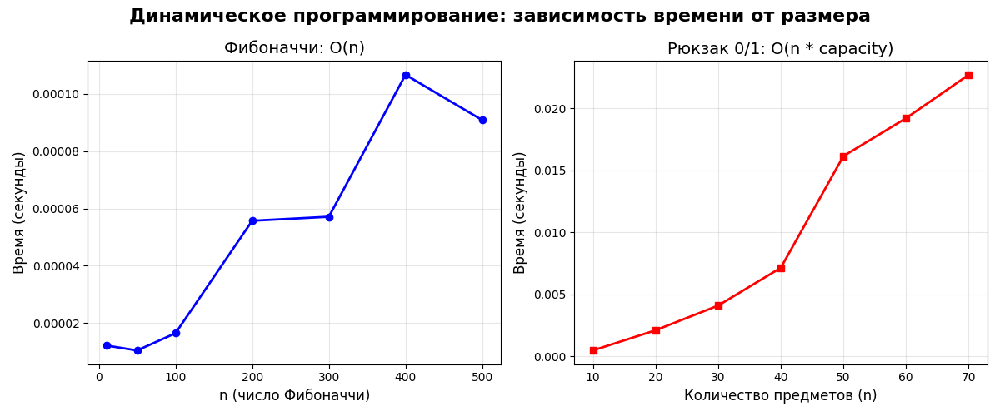

# Лабораторная работа: Динамическое программирование

**Дата:** 2025-12-15
**Студент:** Плескачёв Александр Михайлович
**Группа:** ПИЖ-б-о-23-1

---

## Цель работы
Изучить метод динамического программирования для решения задач с оптимальной подструктурой.

## Характеристики ПК
* **CPU:** AMD Ryzen 3 5300U @ 2.60GHz
* **RAM:** 8 GB DDR4
* **OS:** Windows 11
* **Python:** 3.13.2

## Реализованные алгоритмы

### 1. Числа Фибоначчи (3 подхода)
- **Наивная рекурсия:** O(2ⁿ) — экспоненциальная
- **Мемоизация:** O(n) — линейная  
- **Табличный ДП:** O(n) — линейная

### 2. Рюкзак 0/1 (Knapsack)
- **Табличный ДП:** O(n × capacity) — псевдополиномиальная
- **Результат:** максимальная стоимость при ограниченном весе

## Результаты тестирования

### 1. Сравнение Фибоначчи

| n | Наивная | Мемоизация | Табличный |
|---|---------|------------|-----------|
| 10 | 0.000014 сек | 0.000009 сек | 0.000004 сек |
| 20 | 0.002721 сек | 0.000035 сек | 0.000011 сек |
| 30 | 0.259388 сек | 0.000041 сек | 0.000006 сек |

**Вывод:** Табличный подход самый быстрый.

### 2. Рюкзак 0/1

Предметы: вес=[2,3,4,5], стоимость=[3,4,5,6]
Вместимость: 7
Результат: 9 (максимальная стоимость)

### 3. Замеры производительности

Фибоначчи (n=1000): 0.000050 сек
Рюкзак (n=100 предметов): 0.0250 сек

## Графики
Сохранены в `dp_performance.png`:
1. Фибоначчи: линейный рост O(n)
2. Рюкзак: квадратичный рост O(n × capacity)

## Свойства ДП для этих задач

### 1. Оптимальная подструктура
- **Фибоначчи:** F(n) = F(n-1) + F(n-2)
- **Рюкзак:** решение для n предметов использует решения для n-1 предметов

### 2. Перекрывающиеся подзадачи
- **Фибоначчи:** F(n-2) вычисляется многократно
- **Рюкзак:** подзадачи для меньших вместимостей используются много раз

## Выводы

1. **ДП эффективно** решает задачи с оптимальной подструктурой
2. **Избегает экспоненциальной** сложности через сохранение результатов
3. **Табличный подход** быстрее рекурсивного с мемоизацией

---

## Контрольные вопросы

### 1. Какие два основных свойства задачи указывают на то, что для ее решения можно применить динамическое программирование?
**Ответ:** Оптимальная подструктура и перекрывающиеся подзадачи.

### 2. В чем разница между нисходящим (top-down) и восходящим (bottom-up) подходами в ДП?
**Ответ:**
- **Нисходящий:** рекурсия с мемоизацией, вычисляет только нужные подзадачи
- **Восходящий:** заполняет таблицу снизу вверх, вычисляет все подзадачи

### 3. Как задача о рюкзаке 0-1 демонстрирует свойство оптимальной подструктуры?
**Ответ:** Решение для n предметов строится из решений для n-1 предметов (брать/не брать последний предмет).

### 4. Опишите, как строится и заполняется таблица для решения задачи о наибольшей общей подпоследовательности (LCS).
**Ответ:** Создается таблица (len1+1)×(len2+1). Если символы равны: dp[i][j] = dp[i-1][j-1] + 1. Иначе: max(dp[i-1][j], dp[i][j-1]).

### 5. Как с помощью ДП можно уменьшить сложность вычисления Фибоначчи с O(2ⁿ) до O(n)?
**Ответ:** Сохранять вычисленные значения F(k) в массиве, чтобы не вычислять повторно.

---