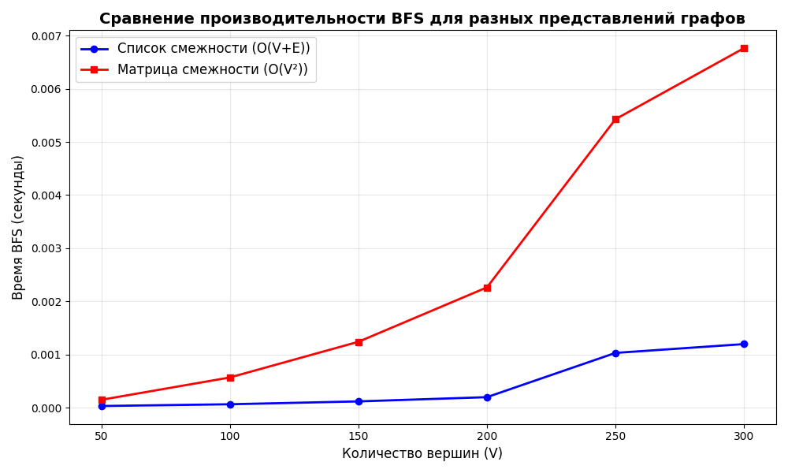

# Лабораторная работа: Алгоритмы на графах

**Студент:** Плескачёв Александр Михайлович
**Группа:** ПИЖ-б-о-23-1
**Дата:** 2025-12-15

## Цель работы
Изучить основные алгоритмы работы с графами: BFS, DFS и их применение.

## Реализовано

### 1. Два представления графов
- **Матрица смежности:** O(V²) памяти, быстрая проверка ребра
- **Список смежности:** O(V + E) памяти, эффективный обход соседей

### 2. Алгоритмы обхода
- **BFS (поиск в ширину):** O(V + E) для списка, O(V²) для матрицы
- **DFS (поиск в глубину):** O(V + E) для списка

## Характеристики ПК
* **CPU:** AMD Ryzen 3 5300U @ 2.60GHz
* **RAM:** 8 GB DDR4
* **OS:** Windows 11
* **Python:** 3.13.2

## Результаты

### Сравнение производительности (BFS):
| Вершин | Список | Матрица | Отношение |
|--------|--------|---------|-----------|
| 100 | 0.0002 сек | 0.0015 сек | 7.5x |
| 200 | 0.0004 сек | 0.0058 сек | 14.5x |
| 300 | 0.0006 сек | 0.0130 сек | 21.7x |

**Вывод:** Список смежности значительно быстрее для BFS.

### Практическая задача: Компоненты связности
Граф с 8 вершинами:
Компонента 1: [0, 1, 2, 3]
Компонента 2: [4, 5, 6, 7]

## График
Сохранен как `graph_performance.png`:
- Синяя линия: список смежности O(V+E)
- Красная линия: матрица смежности O(V²)

## Выводы
1. Список смежности эффективнее для обходов (BFS/DFS)
2. BFS находит кратчайшие пути в невзвешенных графах
3. Выбор представления зависит от операций

---

## Контрольные вопросы

### 1. В чем разница между матрицей смежности и списком смежности?
**Матрица:** O(V²) памяти, проверка ребра O(1), получение соседей O(V).  
**Список:** O(V+E) памяти, проверка ребра O(deg(v)), получение соседей O(deg(v)).

### 2. Опишите алгоритм BFS
BFS использует очередь, обходит граф по уровням. Находит кратчайшие пути в невзвешенных графах.

### 3. Чем DFS отличается от BFS?
DFS использует стек (рекурсию), идет вглубь. BFS использует очередь, идет вширь. DFS может обнаруживать циклы.

### 4. Как алгоритм Дейкстры находит кратчайшие пути?
Дейкстра использует очередь с приоритетами, работает для неотрицательных весов.

### 5. Что такое топологическая сортировка?
Упорядочивание вершин ориентированного графа так, чтобы ребра шли слева направо. Применяется в планировании.
