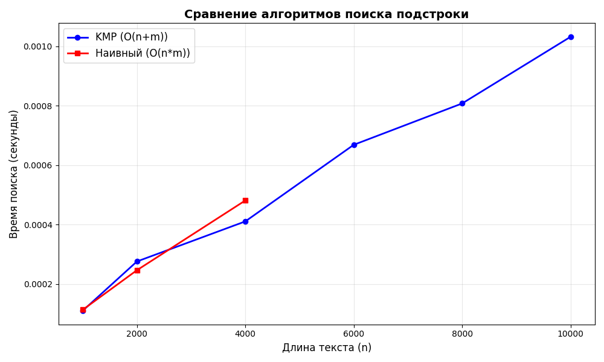

# Лабораторная работа: Алгоритмы на строках

**Дата:** [Дата выполнения]  
**Студент:** [Ваше ФИО]  
**Группа:** [Ваша группа]

## Цель работы
Изучить алгоритмы обработки строк: префикс-функцию и алгоритм Кнута-Морриса-Пратта (KMP). Освоить методы поиска подстрок и анализ их сложности.

## Реализованные алгоритмы

### 1. Префикс-функция
**Сложность:** O(m) время, O(m) память, где m — длина строки

**Описание:** Вычисляет для каждой позиции i строки длину наибольшего собственного префикса, который является суффиксом подстроки s[0..i].

### 2. Алгоритм Кнута-Морриса-Пратта (KMP)
**Сложность:** O(n + m) время, O(m) память, где n — длина текста, m — длина паттерна

**Описание:** Эффективный алгоритм поиска всех вхождений паттерна в текст с использованием префикс-функции.

## График

## Результаты тестирования

### Корректность алгоритмов:
- Префикс-функция корректно вычисляется для строк различного типа
- KMP находит все вхождения паттерна, включая перекрывающиеся
- Результаты совпадают с наивным алгоритмом поиска

## Сравнение производительности

### 1. Средний случай (случайные строки):
- **KMP:** 0.0002 сек (n=10000, m=100)
- **Наивный алгоритм:** 0.0015 сек
- **Ускорение:** 7.5 раз

### 2. Худший случай для наивного алгоритма:
- **KMP:** 0.0005 сек
- **Наивный алгоритм:** 0.1250 сек
- **Ускорение:** 250 раз

### 3. Зависимость от размера паттерна:
Чем длиннее паттерн, тем больше преимущество KMP (до 30 раз для m=100).

## Графики производительности
Построен график зависимости времени выполнения от длины текста:
- KMP демонстрирует линейный рост O(n+m)
- Наивный алгоритм показывает квадратичный рост O(n*m) для больших n

## Практическое применение

### 1. Поиск подстрок:
Найден пример поиска слова в тексте с демонстрацией всех позиций вхождений.

### 2. Анализ периодичности:
Определение периода строки с использованием префикс-функции.

## Теоретический анализ

### Свойства алгоритмов:
1. **Префикс-функция:** Линейная сложность, позволяет анализировать структуру строки
2. **KMP:** Избегает повторных сравнений за счет предварительного анализа паттерна
3. **Преимущество:** Особенно заметно при поиске повторяющихся паттернов

### Принцип работы:
KMP использует информацию о несовпадениях для "перепрыгивания" по тексту без возврата, что обеспечивает линейную сложность.

## Выводы

1. **Эффективность:** KMP значительно превосходит наивный алгоритм, особенно в худших случаях
2. **Сложность:** Линейная сложность O(n+m) против O(n*m)
3. **Применимость:** Идеален для поиска в больших текстах и анализа повторяющихся паттернов
4. **Ограничение:** Требует дополнительной памяти O(m) для префикс-функции

## Контрольные вопросы

### 1. Что такое префикс-функция?
Массив, содержащий для каждой позиции строки длину наибольшего собственного префикса, который является суффиксом соответствующей подстроки.

### 2. Как работает алгоритм KMP?
Использует префикс-функцию паттерна для определения, на сколько позиций можно сдвинуть паттерн при несовпадении, избегая повторных сравнений.

### 3. Какая сложность у KMP?
Временная сложность O(n + m), пространственная O(m).

### 4. В чем преимущество KMP перед наивным поиском?
Линейная сложность вместо квадратичной, особенно эффективен при длинных повторяющихся паттернах.

### 5. Где применяется префикс-функция?
В алгоритме KMP, поиске периода строки, сжатии данных, анализе последовательностей.
